## Microsoft Entra Connect Sync Hybrid Identity Lab

## Project Overview

This project demonstrates the deployment and configuration of a Hybrid Identity environment using Microsoft Entra Connect Sync, Windows Server 2022 Active Directory, and Microsoft 365.

The lab was built on a Dell PowerEdge R720 running Windows Server 2022 and integrated with Microsoft Entra ID to synchronize on-premises Active Directory users to the cloud. User accounts were synchronized, licensed with Microsoft 365 Business Standard, and validated through Exchange Online email communication.

The objective of this project was to gain hands-on experience with Hybrid Identity, Active Directory synchronization, Microsoft Entra ID administration, Microsoft 365 licensing, and Exchange Online user management.

## Technologies Used

Windows Server 2022

Active Directory Domain Services (AD DS)

Microsoft Entra ID

Microsoft Entra Connect Sync

Microsoft 365 Admin Center

Exchange Online

PowerShell

Dell PowerEdge R720

## Skills Demonstrated

Active Directory Administration

Organizational Unit (OU) Management

Microsoft Entra ID Administration

Microsoft Entra Connect Sync Configuration

User Synchronization

Microsoft 365 License Management

Exchange Online Administration

PowerShell Administration

Hybrid Identity Management

Identity and Access Management (IAM)

## Lab Architecture

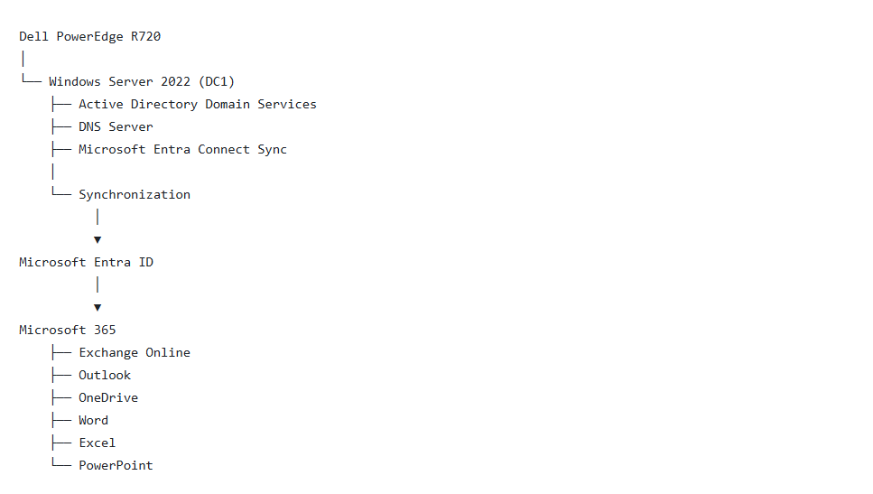

## Project Implementation

## 1. Microsoft Entra Connect Installation

Successfully configured Microsoft Entra Connect Sync using Password Hash Synchronization to synchronize on-premises Active Directory users with Microsoft Entra ID.

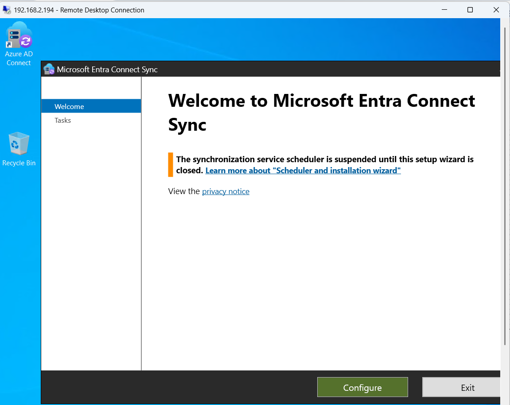

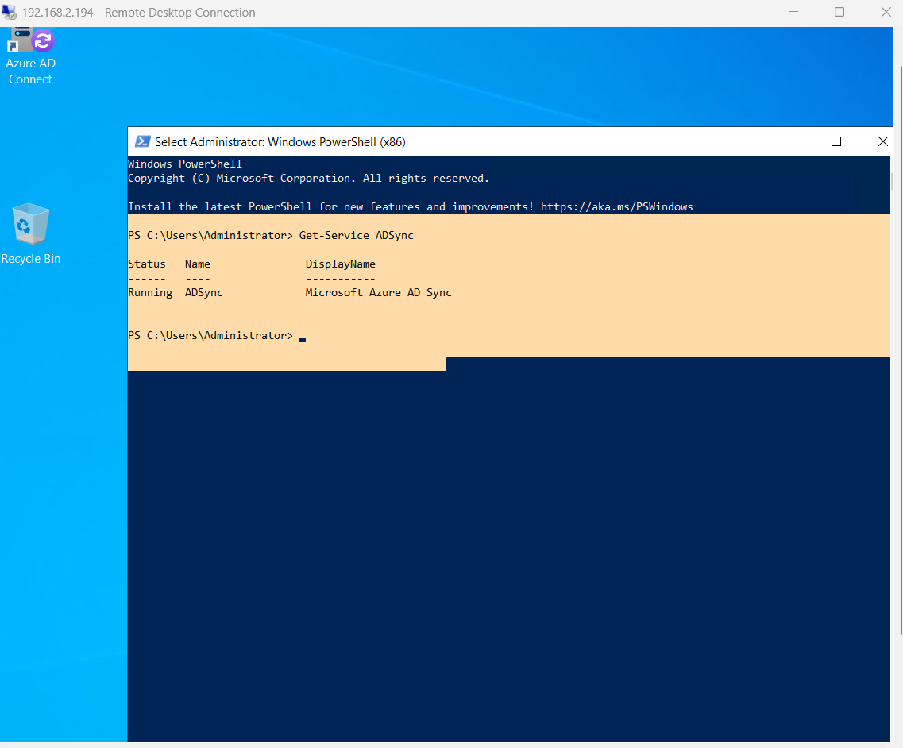

## 2. Synchronized Users in Microsoft Entra ID

Verified that on-premises Active Directory users were successfully synchronized to Microsoft Entra ID.

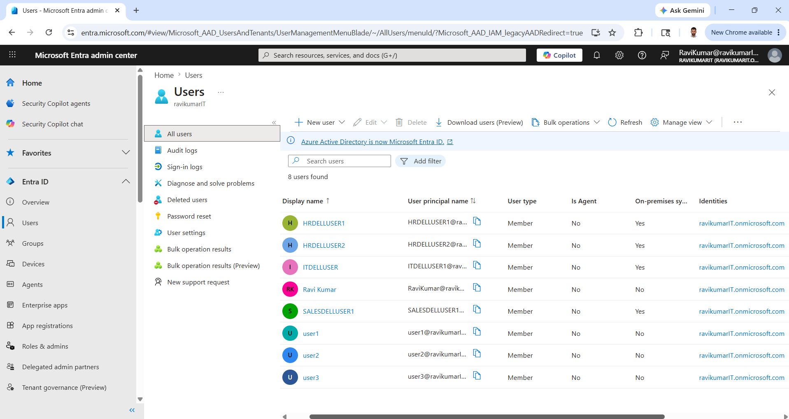

## 3. User Synchronization Details

Validated synchronization status and user identity attributes within Microsoft Entra ID.

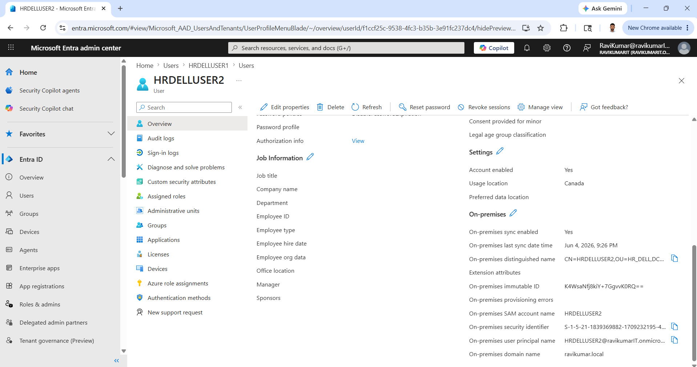

## 4. Microsoft Entra Connect Scheduler

Verified that Microsoft Entra Connect Sync scheduler is configured and automatically performs synchronization every 30 minutes.

PowerShell Command

Import-Module ADSync

Get-ADSyncScheduler

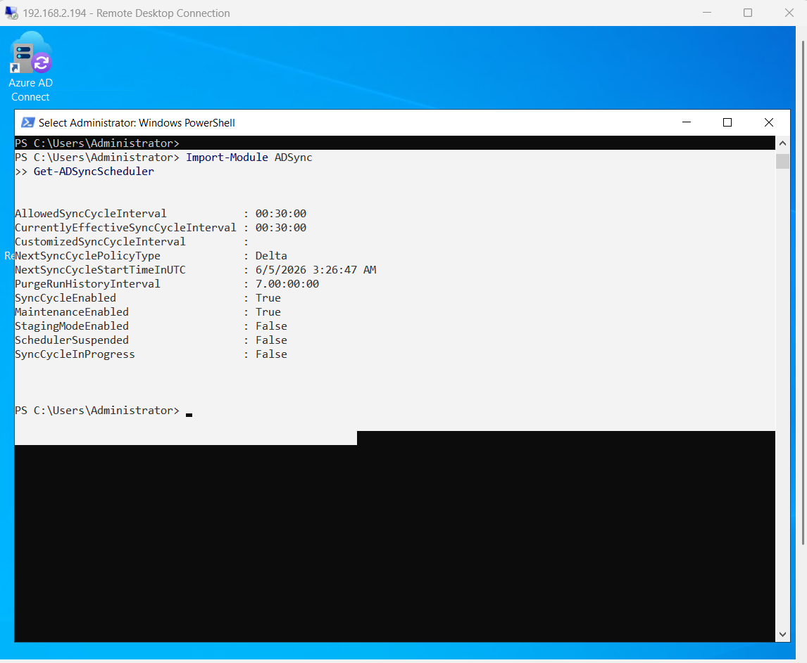

## 5. Synchronization Verification

Verified that HRDELLUSER2 was synchronized from Active Directory to Microsoft Entra ID.

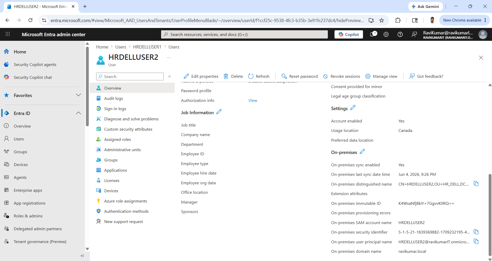

## 6. Active Directory Users and Organizational Units

Verified the Active Directory structure and organizational units containing synchronized users.

Organizational Units

HR_DELL

IT_DELL

SALES_DELL

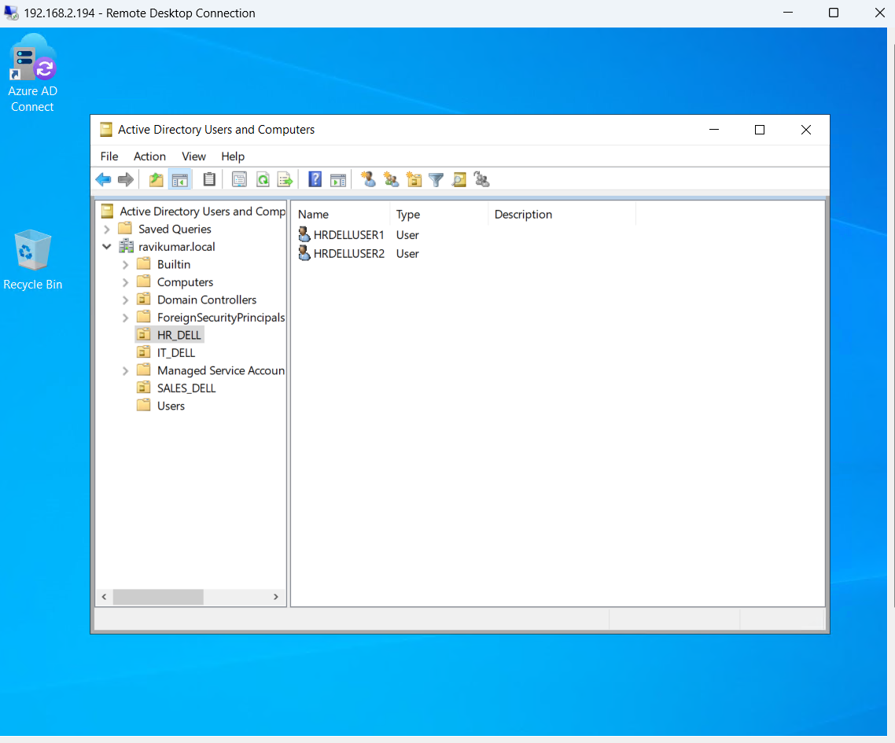

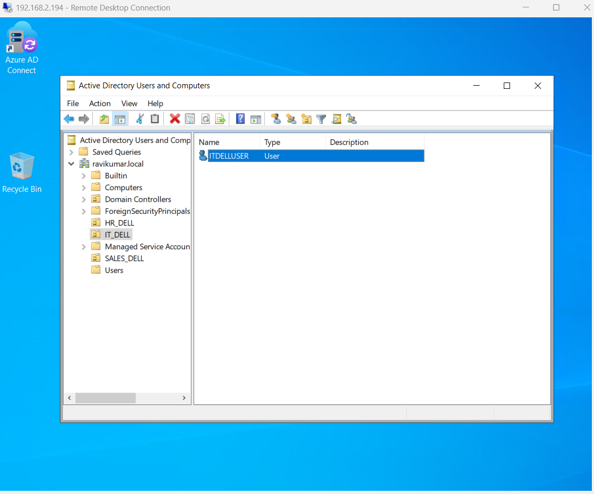

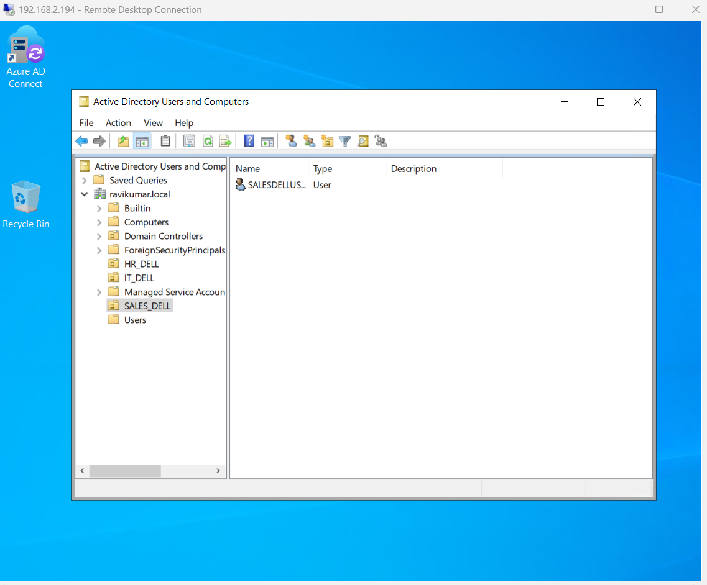

## 7. Manual Synchronization

Performed a manual synchronization using PowerShell to immediately replicate Active Directory changes to Microsoft Entra ID.

PowerShell Command

Import-Module ADSync

Start-ADSyncSyncCycle -PolicyType Delta

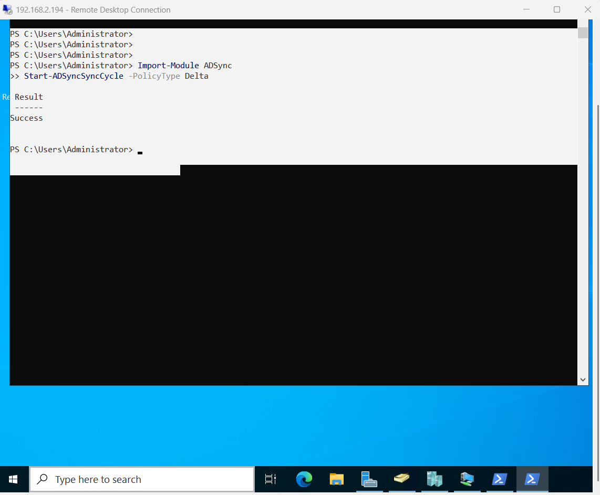

## 8. Microsoft 365 License Assignment

Assigned Microsoft 365 Business Standard licenses to synchronized users.

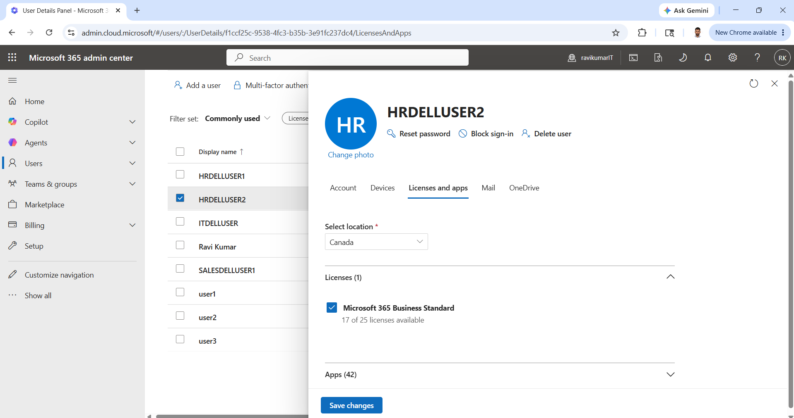

## 9. Microsoft 365 Apps Access

Verified access to Microsoft 365 services including Outlook, OneDrive, Word, Excel, and PowerPoint after license assignment.

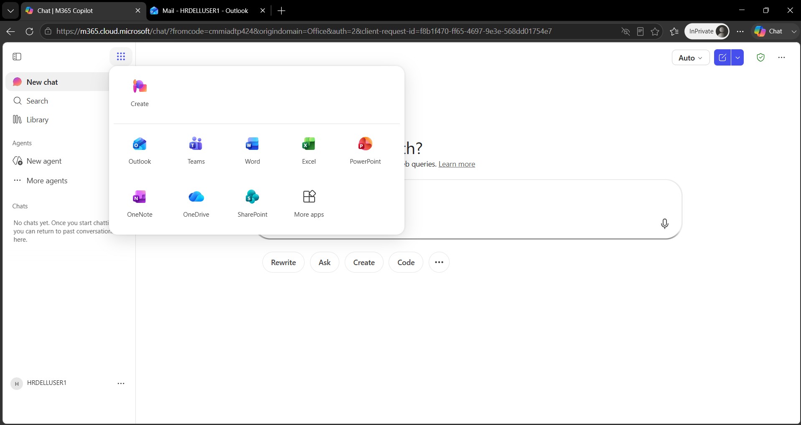

## 10. Exchange Online Mail Flow Validation

Validated end-to-end email communication through Exchange Online.

Test Performed

Sender: HRDELLUSER2

Recipient: user1

Result:

Email Successfully Delivered

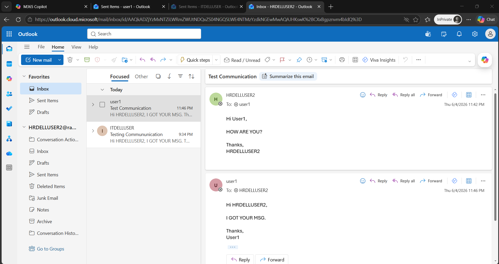

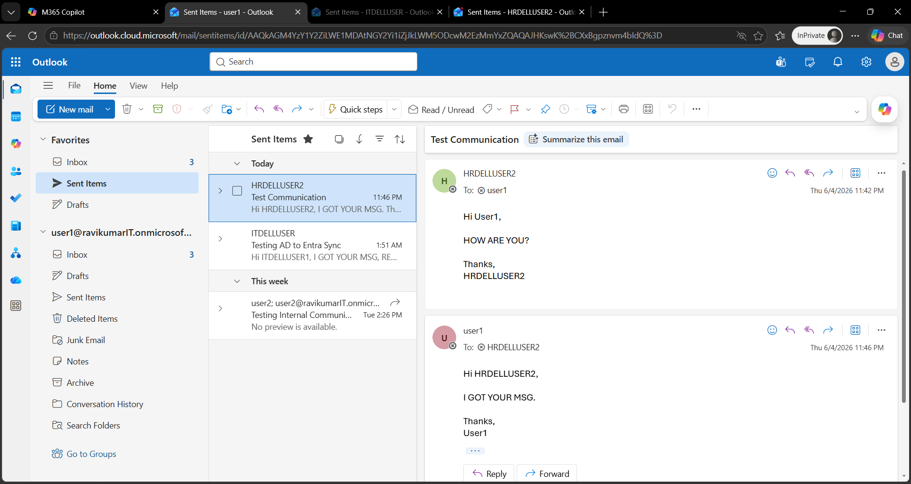

## Results

Successfully implemented a Hybrid Identity environment integrating Windows Server 2022 Active Directory with Microsoft Entra ID and Microsoft 365.

## Achievements

Configured Microsoft Entra Connect Sync

Synchronized Active Directory users to Microsoft Entra ID

Managed Microsoft 365 user licensing

Validated automatic synchronization

Performed manual synchronization using PowerShell

Verified Hybrid Identity functionality

Tested Exchange Online mail flow

Demonstrated enterprise identity management practices

## Author

## Ravi Kumar

